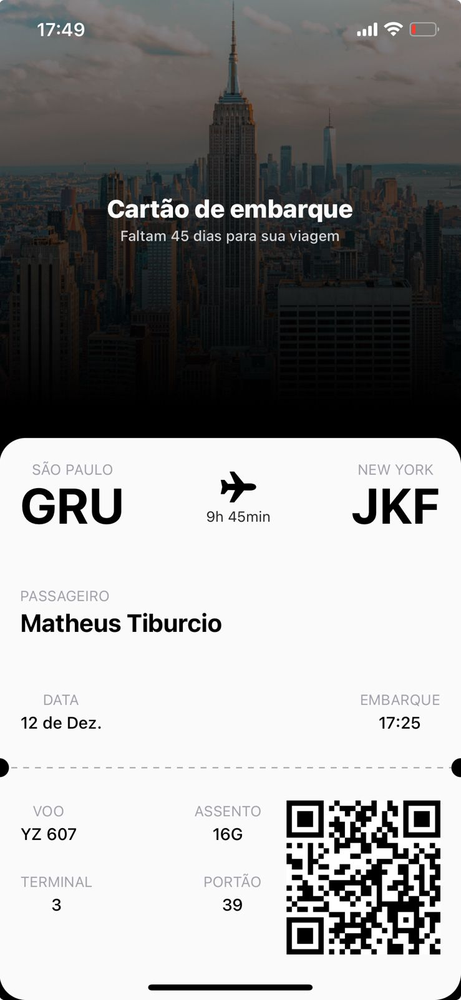

# Ticket App 🛫🎟️

This is a simple "boarding ticket" app created to practice styling in **React Native** with **NativeWind**. It simulates a styled and responsive boarding pass, perfect for learning and practicing mobile design.

## 💡 Features

- Displays flight information (such as origin, destination, flight duration, time, and date).
- QR Code simulating the ticket code.
- Modern design inspired by real boarding passes.
- Styling fully implemented with **NativeWind**.

## 🛠️ Technologies Used

- [React Native](https://reactnative.dev/)
- [Expo](https://expo.dev/)
- [NativeWind](https://www.nativewind.dev/) (Tailwind CSS for React Native)
- [react-native-svg](https://github.com/react-native-svg/react-native-svg) (for SVG graphics and icons)

## 📸 Preview

